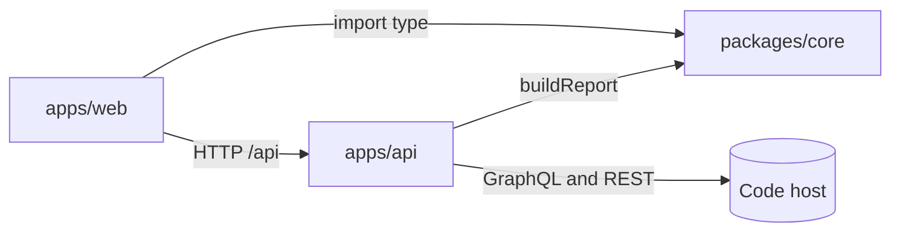

# 2. Turborepo monorepo with a shared core package

Date: 2026-09-29

## Status

Accepted

## Context

The dashboard has an API that crawls and a web app that draws. Both need the same types for a pull request, a deploy run and a report, and the metric arithmetic must be testable without a server, a database or a network.

## Decision

One repository, npm workspaces and Turborepo:

- `packages/core`: domain types and every metric as a pure function. No I/O and no dependencies beyond TypeScript.
- `apps/api`: Fastify, crawls code hosts, stores results, serves reports built by core.
- `apps/web`: React and Vite, imports core's types only (`import type`), so no metric code ships to the browser.

Turbo owns build order (`dependsOn: ["^build"]`) and caches every task on file content. The root `Makefile` is the human interface; it invokes turbo by path so the lockfile's version always runs.

## Consequences

### Positive

- One definition of every type; the web app cannot drift from the API's payload.
- Metric changes are proved by core's unit tests alone, in milliseconds.
- A second pass of `make test` replays from cache when nothing changed.

### Negative

- Core must be built before either app can typecheck or test. Turbo handles this, but running a workspace's scripts directly without `make` or turbo can fail to resolve `@dora-dashboard/core`.
- A cached task replays its old output, so a figure quoted from `make test-coverage` may be stale. Use `make test-coverage-force` before quoting one.
